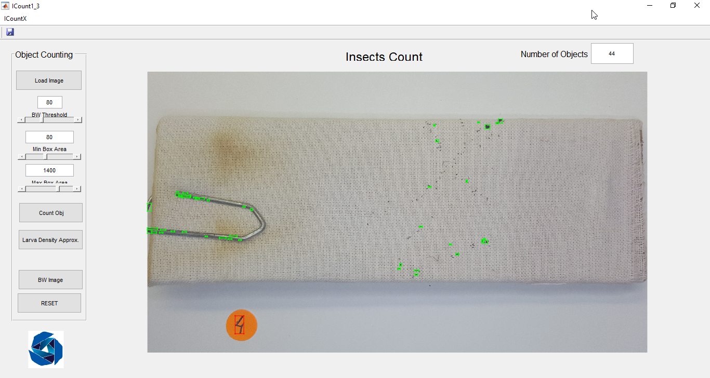

<!--
author:   Andrea Charão

email:    andrea@inf.ufsm.br

version:  0.0.1

language: PT-BR

narrator: Brazilian Portuguese Female

comment:  Review sobre Visão Computacional aplicada a contagem de ovos de mosquitos

-->

<!--
nvm use v10.23.0
liascript-devserver --input README.md --port 3001 --live
-->

# Experimentos de contagem de ovos em ovitrampas

> Experimentos de contagem de ovos com dataset da Fiocruz

Profa. Andrea Schwertner Charão

Acadêmicos: Daniel Schopf, Filipe Kaizer, Francisco Chagas, Gleison Pires

Depto. de Linguagens e Sistemas de Computação, Centro de Tecnologia, UFSM

## Resumo

- Foram realizados experimentos com 2 datasets disponibilizados pelos pesquisadores Gabriel Wallau e André de Sá, da Fiocruz, usando 3 soluções apresentadas em artigos e disponíveis para testes de contagem de ovos: Ovitrap Monitor, ICount e EggCountAI 

- Ovitrap Monitor 

  - disponibiliza código-fonte, conveniente para automatização de experimnentos
  - inicialmente não detectou ovos nas amostras
  - com ajustes no código, conseguimos resultados promissores, com baixo erro % médio
  - resta validar visualmente erros/acertos (validação de alguns casos já realizada)

- ICount e EggCountAI

  - ferramentas de uso exclusivamente manual, sem possibilidade de automatização 
  - erros significativos de detecção e contagem dos ovos
  - com EggCountAI, o tempo de processamento é elevado 

## Dataset Fiocruz

Foram usados 2 datasets contendo imagens e planilhas com resultados anteriores

- A) `fotos_palhetas_andre-20230911T130959Z-001.zip`
- B) `imagens-20230911T130823Z-001.zip`

<!-- data-type="none" -->
| Conjunto   | Em madeirite   | Em tecido   | Qtde. Min. Ovos   | Qtde. Max. Ovos   |
| :--------- | :--------- | :--------- | :--------- | :--------- |
| A     | 9     | 10     | 28     | 8266 |
| B     | 12     | 11     | 3     | 183 | 

### Dataset A

Arquivo: `fotos_palhetas_andre-20230911T130959Z-001.zip`

- 19 imagens, sendo 9 de suporte em madeirite e 10 em tecido
- 5312 x 2998
- EXIF tags: date=2020, manufacturer=samsung, model=SM-G928G
- fotos sobre um fundo branco contendo etiqueta circular na cor laranja
- material em tecido tem clipe metálico fixado na amostra
- planilha 'planilha com número de ovos.xlsx'  

  - contagens manuais (ground truth): 28 a 8266 ovos
  - análises de erro e observações sobre as amostras
  - erro % médio: 23.85%

  

### Dataset B

Arquivo: imagens-20230911T130823Z-001.zip

- 23 imagens, sendo 12 de suporte em madeirite e 11 em tecido
- 4032 x 3023
- EXIF tags: date=2021, manufacturer=samsung, model=SM-G985F
- fotos sobre uma estrutura branca, aparentemente em plástico impresso 3D
- planilha 'Contagem de ovos - imagens de palhetas.xlsx' 

  - apenas contagens manuais (ground truth): 3 a 183 ovos
  - 8 amostras (4 em madeirite, 4 em tecido), contagens em 5 datas
  - não há imagens correspondentes a todas as datas (seriam 40 imagens, mas temos apenas 23)

## Experimentos com Ovitrap Monitor

- [Hamesse et al. 2023] Charles Hamesse, Verónica Andreo, Carla Rodriguez Gonzalez, Charles Beumier, Jorge Rubio, Ximena Porcasi, Laura Lopez, Claudio Guzman, Rob Haelterman, Michal Shimoni, C. Marcelo Scavuzzo, Ovitrap Monitor - Online application for counting mosquito eggs and visualisation toolbox in support of health services, Ecological Informatics, v. 75, 2023. https://doi.org/10.1016/j.ecoinf.2023.102105

- *"an online open source and user-friendly integrated application that semi-automatically counts mosquito eggs from low-medium resolution mobile phone pictures"*

- Algoritmo claramente descrito no artigo
- Código-fonte disponível em: 
  
  - https://gitlab.com/charles.hamesse/ovitrap-monitor-server
  - https://gitlab.com/charles.hamesse/ovitrap-monitor-client

- Parte do código e das decisões de projeto derivadas de MECVision: https://abtassociates.github.io/mecvision/

- Apresentação com decisões de projeto: https://www.youtube.com/watch?v=9e8qfHQrJgM (em espanhol)

- Dataset com 300 imagens disponível em: https://ri.conicet.gov.ar/handle/11336/201038

### Parâmetros

- Apenas um parâmetro: threshold (valor padrão: 64, faixa: 0 a 150)
- Internamente, define um parâmetro constante relativo ao tamanho do ovo, considerando também o tamanho da palheta:

  - "the stick width is roughly 20 mm and the radius of an egg is 0.5 mm (Mundim-Pombo et al., 2021)"

- Disponibilidade de código-fonte permite automatizar experimentos sem necessidade de uso da interface web

### Hardware utilizado

- Dell Optiplex 
- Intel(R) Core(TM) i7-7700T @ 2.90GHz
- 8 núcleos
- 16G RAM

### Experimentos com parâmetros originais

1. Criamos scripts em Python para automatizar experimentos, com as seguintes entradas:

   - imagens: uma pasta com múltiplas imagens ou um único arquivo de imagem
   - threshold: um único valor ou uma lista de valores 

2. Renomeamos os arquivos de imagens de forma padronizada, conveniente para automatização

#### Todas imagens, alguns thresholds

1. Executamos experimentos para todas imagens do dataset A, thresholds: 62, 64 (default), 66

2. Calculamos erro como consta nas planilhas que acompanham os datasets ((`true_count-total_count)/true_count`))

Resultados:

- Disponíveis em: https://docs.google.com/spreadsheets/d/e/2PACX-1vQ2wN5lNpGedVW2wOvIWJCaEBu6E2DK3gNqg_9tff4twIBdHyxTQwcPhv97n1EiW3tEIbIau3j25xy1/pubhtml?gid=1553144835&single=true

- Erros significativos, em torno de 100%

#### Uma imagem, vários thresholds

1. Selecionamos amostra 04T do dataset A: amostra limpa em tecido, com 176 ovos, cuja contagem nos experimentos da Fiocruz tinha sido bem sucedida (erro 5.1%)

2. Executamos experimentos com thresholds  1, 3, 5..150 (cobrindo todo o intervalo do OvitrapMonitor, com incrementos de 2 em 2)

3. Execução abortada no threshold 121, pois o erro continuava alto e o tempo de processamento de cada experimento foi aumentando significativamente

Resultados:

- Disponíveis em: https://docs.google.com/spreadsheets/d/e/2PACX-1vQ2wN5lNpGedVW2wOvIWJCaEBu6E2DK3gNqg_9tff4twIBdHyxTQwcPhv97n1EiW3tEIbIau3j25xy1/pubhtml?gid=1075916260&single=true

- Erros significativos, em torno de 100%

### Tuning do código para datasets Fiocruz

- Ajustamos o código para mostrar imagens intermediárias durante o processo

- Verificamos que o algoritmo para identificação da região de interesse não estava localizando corretamente as palhetas

##### Recorte das imagens

- Criamos um script em Python para recortar imagens a partir de ajustes no algoritmo `find_stick`: conversão de cores (GRAY ao invés de HSV) e aplicação de mais 4 níveis de `blur`

- Cada recorte salvo em um novo arquivo

- Executamos novamente os experimentos para todas imagens do dataset A, agora previamente recortadas, thresholds: 62, 64 (default), 66

Resultados:

- Disponíveis em: https://docs.google.com/spreadsheets/d/e/2PACX-1vQ2wN5lNpGedVW2wOvIWJCaEBu6E2DK3gNqg_9tff4twIBdHyxTQwcPhv97n1EiW3tEIbIau3j25xy1/pubhtml?gid=716879856&single=true

- Diminuição dos erros em alguns casos, mas no geral os erros ainda permaneceram significativos

##### Ajuste na proporção dos ovos

- Com as imagens recortadas, aplicamos o algoritmo original e examinamos novamente as imagens intermediárias

- Notamos que muitos ovos apareciam na imagem BW, mas depois estavam sendo filtrados devido ao tamanho estipulado no algoritmo

- Testamos novas proporções de tamanho dos ovos no código, gerando imagens intermediárias

- Definimos uma nova proporção que permitiu identificar corretamente vários ovos em algumas amostras testadas

- A partir disso, executamos novos experimentos, cujos resultados são apresentados a seguir

### Experimentos com código e parâmetros modificados

- Realizamos experimentos com datasets A e B, com thresholds variados

- Não foram testados todos os thresholds devido ao elevado tempo de processamento 

  - Processamento de uma imagem pode levar de alguns segundos a alguns minutos 
  - Quando a aplicação do threshold resulta em muitos pixels "candidatos a ovos", o processamento leva mais tempo  
  - Isso pode acontecer quando a amostra tem muitos ovos ou quando a filtragem inicial deixa passar muitos pixels

#### Resumo e discussão dos resultados

> Erro diminuiu significativamente, mas resta ainda validar visualmente os erros/acertos

- Com ajustes realizados no algoritmo, experimentos com diferentes thresholds resultou em diminuição significativa do erro (%) médio, **considerando apenas contagens**

  - 7,6 % para dataset A
  - 19,2 % para dataset B
  - possível melhoria dos resultados se experimentarmos mais thresholds

- Sumário de resultados dataset A: https://docs.google.com/spreadsheets/d/e/2PACX-1vQ2wN5lNpGedVW2wOvIWJCaEBu6E2DK3gNqg_9tff4twIBdHyxTQwcPhv97n1EiW3tEIbIau3j25xy1/pubhtml?gid=1341170607&single=true

- Sumário de resultados dataset B: https://docs.google.com/spreadsheets/d/e/2PACX-1vQ2wN5lNpGedVW2wOvIWJCaEBu6E2DK3gNqg_9tff4twIBdHyxTQwcPhv97n1EiW3tEIbIau3j25xy1/pubhtml?gid=327369260&single=true

#### Dataset A

Planilha com dados brutos de processamento do dataset A

https://docs.google.com/spreadsheets/d/e/2PACX-1vQ2wN5lNpGedVW2wOvIWJCaEBu6E2DK3gNqg_9tff4twIBdHyxTQwcPhv97n1EiW3tEIbIau3j25xy1/pubhtml?gid=0&single=true

#### Dataset B

Planilha com dados brutos de processamento do dataset B

https://docs.google.com/spreadsheets/d/e/2PACX-1vQ2wN5lNpGedVW2wOvIWJCaEBu6E2DK3gNqg_9tff4twIBdHyxTQwcPhv97n1EiW3tEIbIau3j25xy1/pubhtml?gid=1403767310&single=true

## Experimentos com ICount

- [Gaburro et al. 2016] Gaburro J, Duchemin JB, Paradkar PN, Nahavandi S, Bhatti A. Assessment of ICount software, a precise and fast egg counting tool for the mosquito vector Aedes aegypti. Parasit Vectors. 2016 Nov 18;9(1):590. https://doi.org/10.1186%2Fs13071-016-1870-1

- Software disponível em: https://www.dropbox.com/sh/28vm6tv7wrm76ln/AADsCz8lQB37qU-n8j2qGjw_a?dl=0

### Parâmetros

Fonte: [Gaburro et al. 2016]

Parâmetros a ajustar:

- BW Threshold: *"BW Threshold defines the binary cut-off value to convert a grayscale image into black and white and takes the value within the range of [0 255], where 0 represents black and 255 represents white (default 80)"* 
- Min Box Area: *"min approximate area covered by a single egg in pixels (default 80)"*
- Max Box Area: *"max approximate area covered by a single egg in pixels (default 1400)"*

### Experimentos

- Foram selecionadas 3 amostras para estes experimentos:

  - Dataset A, amostra tecido 04T com quantidade intermediária de ovos: 176
  - Dataset A, amostra tecido 10T com a maior quantidade de ovos: 7366
  - Dataset B, amostra madeirite 04M-07-09  com a maior quantidade de ovos: 183

- Foram feitas pelo menos 2 contagens com cada amostra: uma com valores default e outra com ajuste manual de parâmetros, buscando aproximar a contagem do valor real

- Hardware utilizado: Notebook Lenovo Yoga, Intel Core i7 7550U, 4 núcleos, 8GB RAM

### Resultados

Todos os resultados de contagem (Count) diferem significativamente dos valores reais (True Count):

<!-- data-type="none" -->
| Amostra   | BW Thresh   | Min Box   | Max Box   | True Count   | Count | Erro |
| :---------  | :--------- | :--------- | :--------- | :--------- | :--------- | :--------- |
| 04T      | 80     | 80     | 1400     | 176     | 44 | 75% |
| 04T      | 85     | 35     | 1400     | 176     | 145 | 17.6% |
| 04T      | 100     | 55     | 1400     | 176     | 119 | 32.3% |
| 10T      | 80     | 80     | 1400     | 7399     | 653 | 81.2% |
| 10T      | 50     | 1     | 1400     | 7399     | 4181 | 43.5% |
| 04M      | 80     | 80     | 1400     | 183     | 2314 | > 100% |
| 04M      | 125     | 24     | 1400     | 183     | 150 | 18% |

### Imagens

### Observações

- Software muito citado em outros trabalhos, usado como referência para novos algoritmos
- Interface gráfica bastante simples, útil em ambiente de pesquisa/laboratório
- Algoritmo usado não está descrito claramente no artigo
- Não permite definir região de interesse, portanto as imagens precisam ser "recortadas" previamente ou capturadas com cuidado para não incluir regiões de contraste que possam ser confundidas com ovos
- Não emite relatório e não permite conexão com outros sistemas, portanto a contagem de ovos em experimentos deve ser observada no software e transcrita manualmente em planilhas
- Ajuste de 2 parâmetros é moroso e torna impraticável testar todas as combinações
- Não há garantia de que haverá alguma combinação de parâmetros capaz de acertar a contagem/localização correta de todos os ovos

## Experimentos com EggCountAI

- [Javed et al. 2023] Javed, N., López-Denman, A.J., Paradkar, P.N., Bhatti, A. EggCountAI: a convolutional neural network-based software for counting of Aedes aegypti mosquito eggs. Parasit Vectors. 2023 16, 341 (2023). https://doi.org/10.1186/s13071-023-05956-1

- É uma ferramenta desenvolvida no mesmo grupo de pesquisa que desenvolveu o ICount

- Software disponível em: https://drive.google.com/drive/folders/1SdICI1nNeVPuJtdgSUfOol46zoq4LYIj?usp=share_link

- Há 2 versões do software para download: para computadores com/sem hardware acelerador (GPU)

- Hardware utilizado: Notebook Lenovo Yoga, Intel Core i7 7550U, 4 núcleos, 8GB RAM (mesmo hardware utilizado com ICount)

### Parâmetros

- Micro/Macro: imagem feita com microscópio / câmera
- Horizontal / Vertical Div: divisão da imagem em partes ("enabling the processing of larger images that would be otherwise infeasible due to memory limitations or computational constraints")
- Filtration: 0.1 a 10.0, default 3.0 (*)
- Confidence:  0.0 a 1.0, default 0.7 (**)
- Folder: pasta contendo uma ou mais imagens

Observações extraídas do artigo:

- (\*)*"Setting the filtration level parameter can be used to eliminate noise and mpurities from the input image. It takes a value within a range from 0.1 to 10.0. Setting the value to 0.1 means that it will eliminate all the objects in each patch which are 0.1 times larger or smaller than the average size of eggs in that patch. Setting the value to 10.0 means that it will eliminate all the objects in each patch which are 10.0 times larger or smaller than the average size of eggs in that patch. The default value of the filtration level is set at 3.0"*

- (\*\*) *"1.0 means that the software is fully confident that the detected object is the mosquito egg. A default confidence value of 0.7 was used"*

### Experimentos

- Nestes experimentos, usamos amostras do dataset B, previamente recortadas, para evitar problemas observados anteriormente no ICount (ovos detectados fora das palhetas)

- Selecionou-se o modo Macro, com 4 divisões horizontais/verticais (impacto no uso de memória) e os demais parâmetros default (filtration 3.0 e confidence 0.7)

- O processamento de uma única amostra mostrou-se muito longo, podendo levar vários minutos

- **Interrompemos o processamento depois de 2 amostras analisadas (uma em tecido e outra em madeirite)**

### Resultados

Todos os resultados de contagem (Count) diferem significativamente dos valores reais (True Count):

<!-- data-type="none" -->
| Amostra   |  True Count   | Count | Erro |
| :---------  | :--------- | :--------- | :--------- |
| 02T-07-09      | 3     | 267 | > 100% |
| 02M-08-05      | 28     | 136 | > 100% | 

### Imagens

### Observações

- Resultados são salvos em uma pasta, com contagens e imagens com ovos identificados
- Elevado tempo de processamento dificulta realizar muitos experimentos
- Resultados têm erros significativos de contagem nos casos analisados
- Resta experimentar ajuste de parâmetros, mas isso implicaria muito tempo de processamento
- Claramente, a rede neural utilizada foi treinada com imagens de maior contraste e regiões/palhetas menores, com ovos proporcionalmente maiores em relação a nossas amostras

## Próximos passos

2 frentes de trabalho paralelas:

1. Contagem automática

   - criação de ground truth contendo contagens e localização dos ovos nas imagens
   - realizar experimentos para avaliar solução usando método de template matching, desenvolvida em Python com OpenCV (solução já desenvolvida)
   - desenvolver possível solução usando Mask RCNN (https://github.com/matterport/Mask_RCNN), treinamento com dataset Fiocruz

2. Aplicativo do agente
   
   - máscara para guiar posicionamento da câmera sobre a palheta
   - recorte automático
   - registro automático de características da câmera/dispositivo
   - usar definição manual de threshold?
   - coletar observações do agente? (inspeção visual de densidade de ovos, presença de sujeira, etc.)
   
