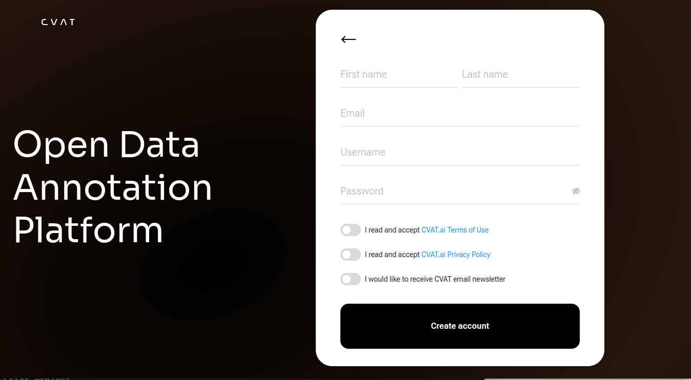
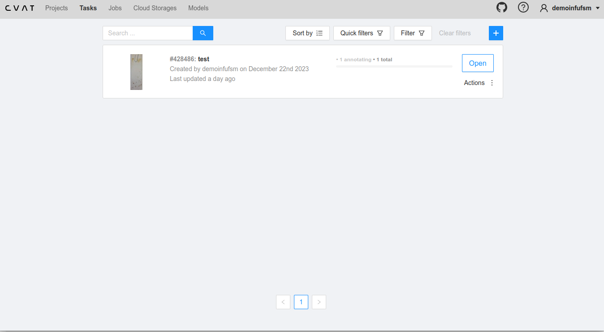
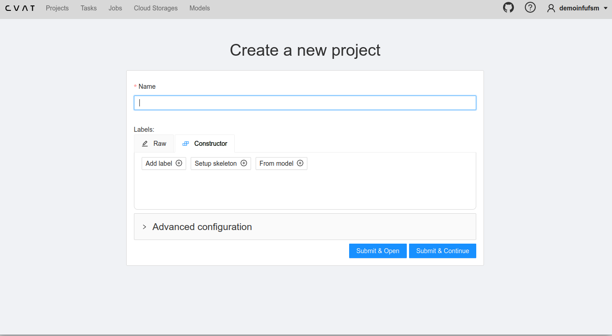
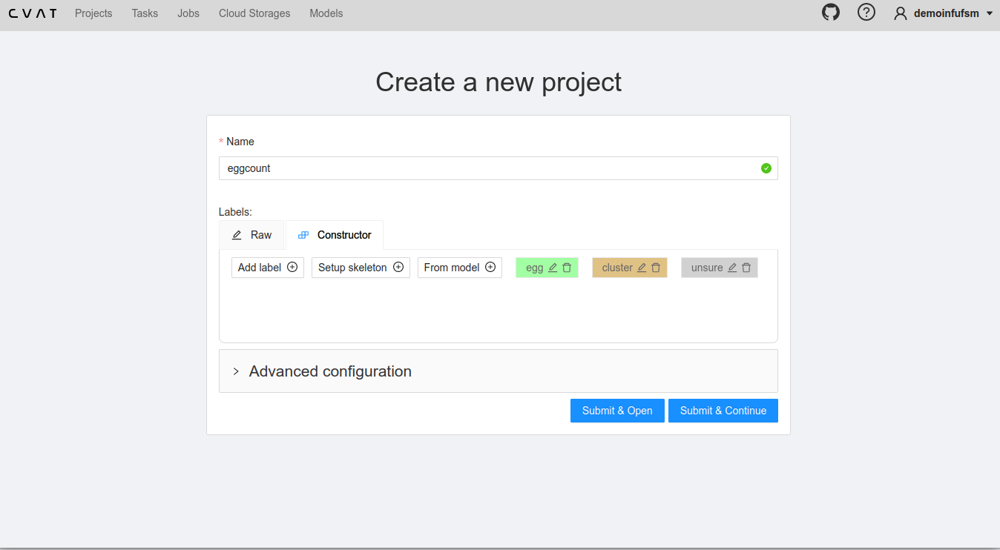
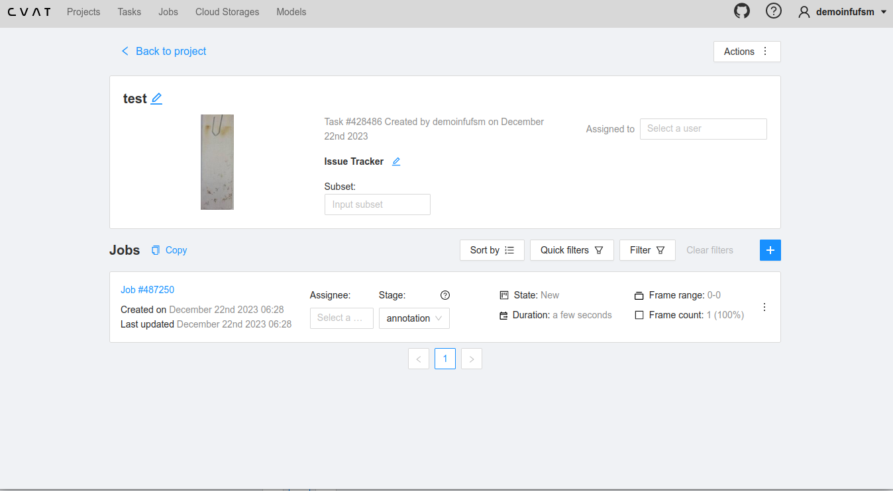
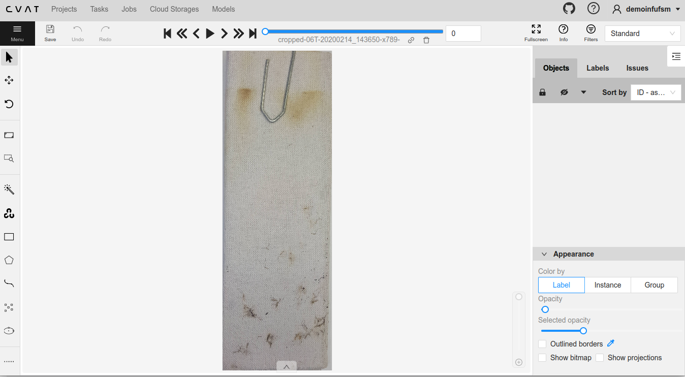
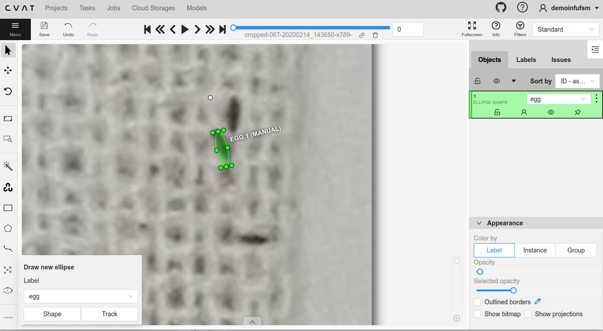
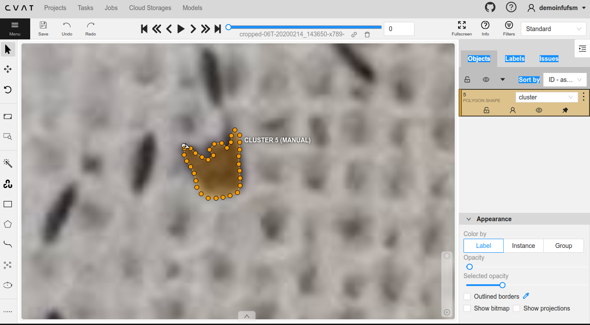

<!--
author:   Andrea Charão

email:    andrea@inf.ufsm.br

version:  0.0.1

language: PT-BR

narrator: Brazilian Portuguese Female

comment:  Resumo sobre anotação de imagens para projeto de contagem de ovos em ovitrampas

-->

# Anotação de imagens com CVAT

> Resumo sobre anotação de imagens para projeto de contagem de ovos em ovitrampas

Profa. Andrea Schwertner Charão

Depto. de Linguagens e Sistemas de Computação, Centro de Tecnologia, UFSM

## Contexto

O que é anotação de imagens?

- Processo de demarcação e rotulagem de objetos em imagens
- Provê contexto e informação de entrada para algoritmos de aprendizagem de máquina

Por que anotar imagens?

- Necessário para treinar modelos de aprendizagem de máquina a reconhecer nossos objetos de interesse

- Importante para obter altas taxas de acertos e generalização no reconhecimento / contagem de objetos

## CVAT (Computer Vision Annotation Tool)

- Uma dentre várias ferramentas populares e em rápida evolução
- Ferramenta open source (https://github.com/opencv/cvat) associada a serviço em nuvem (https://www.cvat.ai/)
- Plano gratuito oferece recursos suficientes para nosso caso

## Conceitos do workflow de anotação com CVAT

- **Organization**: grupo de usuários trabalhando em conjunto

  - Plano gratuito permite 1 organization com 3 usuários
  - Facilita compartilhamento, mas não é obrigatório

- **Project**: conjunto de tarefas de anotação com características em comum

  - Aqui são definidos labels a serem usados nas anotações (exemplo: egg, cluster, unsure)

- **Task**: conjunto de uma ou mais imagens a anotar

  - Usa labels padronizados definidos em Project

- **Job**: realização de anotações sobre imagens de uma Task

## Passo-a-passo

- Nos próximos slides, temos um resumo de passos essenciais para começarmos a anotar imagens de ovitrampas
- Estes e outros passos estão detalhados na documentação do CVAT: https://opencv.github.io/cvat/docs/manual/basics/

### Criar conta

Criar uma conta em: https://app.cvat.ai/auth/register (abrir email e clicar no link de confirmação para ativar a conta)

### Após Login

Após Login, é mostrada uma tela com Tasks (inicialmente vazia)

Tela de Tasks vazia (sem Tasks ciradas ainda):

 

Tela com uma Task criada (ver mais adiante):

### Criar Project

Project: conjunto de tarefas de anotaçõo com características em comum

Para criar:

- Menu: Projects
- Botão: `+` -> `Create a new project`
- Preencher tela abaixo com configurações do projeto (ver adiante)

#### Configurar projeto

- Prencher nome do projeto: `eggcounting`
- Criar labels: clicar em `Add label`
- A cada novo label, clicar em `Continue`

- Label para um ovo (quando for possível distinguir com certeza)

  - Label name: `egg`
  - Selecionar `Ellipse`
  - Escolher cor

- Label para um agrupamento de ovos (quando houver sobreposição que impeça distinguir ovos isoladamente)

  - Label name: `cluster`
  - Selecionar `Polygon`
  - Escolher cor

- Label para possível ovo (incerteza)

  - Label name: `unsure`
  - Selecionar `Ellipse`
  - Escolher cor

#### Projeto configurado com labels

Estado final da configuração do projeto após cadastro de labels

### Criar Task

Task é um conjunto de imagens a anotar.

#### Configurar Task

- Clicar em botão `+` para adicionar Task (`Create a new task`)

- Name: definir nome da Task
- Project: selecionar  `eggcounting`
- Select files: `My computer` (selecionar imagens a serem anotadas)
- Submit & Open

#### Task configurada

### Realizar Job

- Job é uma sessão de anotações sobre imagens de uma Task.

- Quando uma Task é criada, automaticamente já é criado um Job

- Clicar sobre um Job para ver a imagem e as opções de anotação

#### Imagem e ferramentas

Tela do job mostra a imagem e várias ferramentas

#### Anotação de ovos

Controles

- Zoom in/out: scroll do mouse
- Mover imagem: segurar botão esquerdo do mouse

Ovos

- Selecionar Elipse e Shape no menu à esquerda
- Desenhar elipse próximo ao ovo
- Ajustar tamanho e rotação
- Usar atalhos e copy-paste (Ctrl-C Ctrl-V) para os próximos

#### Anotação de clusters

- Selecionar Polygon e Shape no menu à esquerda
- Fazer o contorno do agrupamento de ovos:

  - Opção 1: marcando os pontos um a um com o mouse **ou**
  - Opção 2: pressionando Shift e passando o mouse pela borda do agrupamento (pontos adicionados automaticamente)

- Teclar N para fechar o polígono
- Ajustar pontos se necessário

## Referências

CVAT:

- CVAT - Projects page:  https://opencv.github.io/cvat/docs/manual/advanced/projects/

- CVAT - Create annotation task:  https://opencv.github.io/cvat/docs/manual/basics/create_an_annotation_task/

- CVAT - Annotation with polygons:  https://opencv.github.io/cvat/docs/manual/advanced/annotation-with-polygons/manual-drawing/

Outras ferramentas de anotação:

- Deep Learning::Ensinando à Rede: Ferramentas de Anotação: (resumo sobre várias ferramentas)  https://lapix.ufsc.br/ensino/visao/visao-computacionaldeep-learning/deep-learningensinando-rede-ferramentas-de-anotacao/?lang=en 

