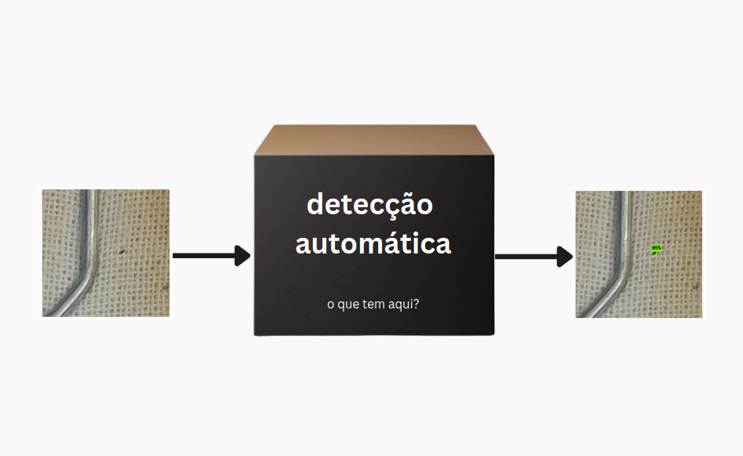
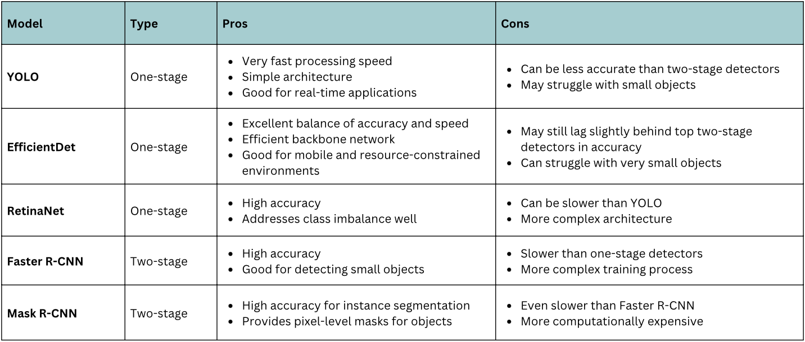
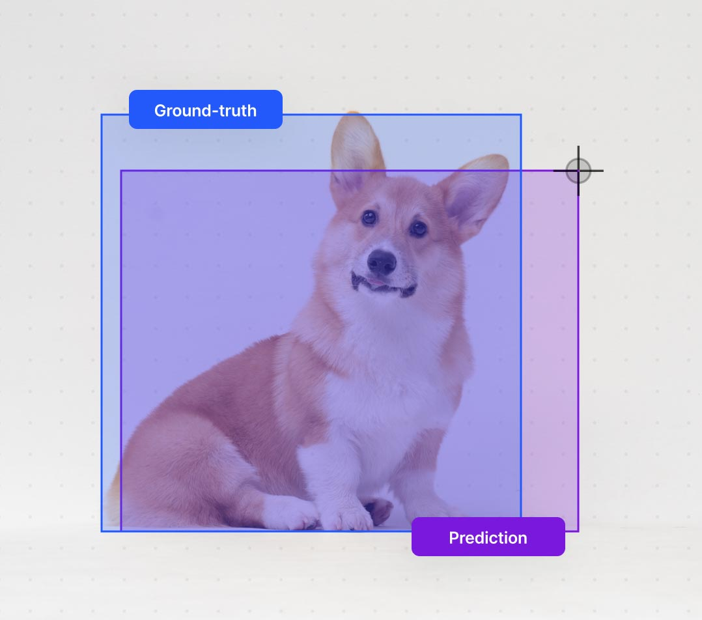
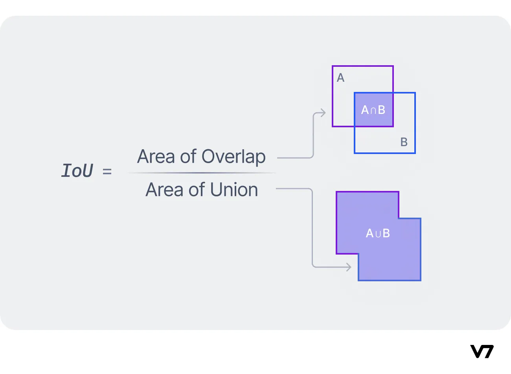
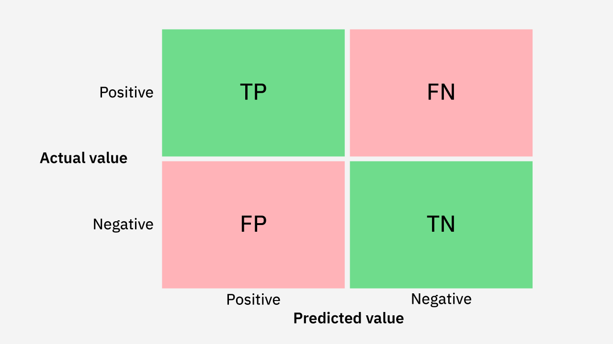

<!--
author:   Andrea Charão

email:    andrea@inf.ufsm.br

version:  0.0.1

language: PT-BR

narrator: Brazilian Portuguese Female

comment:  Resumo sobre aprendizagem de máquina para detecção de ovos

-->

<!--
nvm use v10.23.0
liascript-devserver --input README.md --port 3001 --live
-->


[](https://liascript.github.io/course/?https://raw.githubusercontent.com/AndreaInfUFSM/CIPCDengue/master/docs/03-TrainObjectDetectionModel/TrainObjectDetectionModel.md)


# Machine Learning para Detecção de Ovos em Ovitrampas


> Resumo sobre aprendizagem de máquina para detecção de ovos em imagens de ovitrampas

Profa. Andrea Schwertner Charão

Depto. de Linguagens e Sistemas de Computação, Centro de Tecnologia, UFSM


## Objetivo

O que queremos?





## Abrindo a caixa preta

Ciclo de desenvolvimento de um novo detector:


<!--
style="
  display: block;
  margin-left: auto;
  margin-right: auto;
  max-width: 315px;
  stroke: green;" -->

``` ascii
+------------+     +-------------------+     +------------------+     +----------+     +-----------+
|  Anotar    |---->|  Selecionar rede  |---->|  Preparar dados  +---->|  Treinar |---->|  Avaliar  +
+------------+     +-------------------+     +------------------+     +----------+     +-----------+
                            A                          A                                     |
                            |                          |                                     |
                            +--------------------------+-------------------------------------+

                                                                                             
```


                 {{1}}
************************************************
Anotar imagens para formar *ground truth* (serve tanto para aprendizagem como para avaliação do detector)
************************************************

 
                 {{2}}
************************************************
Selecionar rede pré-treinada (*transfer learning*)

- aprendizagem supervisionada: aprende com o conhecimento expresso pelas anotações 
- transfer learning: evita muito tempo/trabalho com treino "do zero"
************************************************

                 {{3}}
************************************************
Preparar os dados: converter anotações para formato usado pela rede selecionada (imagens, labels, localização dos objetos), processar imagens
************************************************

                 {{4}}
************************************************
Treinar modelo:

- separar dataset para treino, validação e teste (geralmente 70%, 20%, 10% das imagens, respectivamente)

- executar número fixo de épocas/passos (p.ex. 1000) ou até atingir condição (mais épocas, mais tempo de processamento) - epochs x steps: https://www.geeksforgeeks.org/what-is-the-difference-between-steps-and-epochs-in-tensorflow/

- executar treinamento inicialmente no Colab (GPU com limite variável), depois no Kaggle (GPU com limite semanal)

- exportar modelo: salvar configurações da rede
************************************************

                 {{5}}
************************************************
 Testar/avaliar modelo

- carregar função detectora

- aplicar função em imagens de teste

- calcular métricas de desempenho: matriz de confusão, precisão, revocação (recall), F1-Score, AP (average precision)
************************************************

                 {{6}}
************************************************
Analisar resultados, fazer ajustes e repetir a partir do passo 2 ou 3, com ajustes
************************************************


### Ferramentas

- Python + plataformas/frameworkds/bibliotecas (TensorFlow, PyTorch, Scikit-Learn, Detectron2, etc.)

- Notebooks: Google Colab, Kaggle, Paperspace (facilidade sem instalação local + acesso a GPUs)

- Plataformas low-code / no-code (Roboflow, Dataloop, V7, etc.) 

#### Notebooks Colab

- TensorFlow Object Detection: https://www.tensorflow.org/tfmodels/vision/object_detection
- Conversão de dados (Tiago): https://colab.research.google.com/drive/1YGR6Fb5I_GKj_q9LHcRKRu_MgVJN4JRO?usp=sharing

### Selecionando rede

- Novas redes são publicadas com frequência por empresas e pesquisadores, treinadas com grandes datasets de algumas categorias de objetos

- Transfer learning: reutilizar um modelo pré-treinado como ponto inicial para treinamento com novos objetos e imagens



Fonte: dagshub.com

### Avaliando desempenho

Importante conhecer algumas métricas e como calculá-las:

- Intersection Over Union
- Matriz de confusão
- Precisão
- Recall (revocação)
- F1-Score


#### IoU

- Intersection Over Union
- Medida objetiva para comparar ground truth com predição do modelo
- Ver este guia: https://www.v7labs.com/blog/intersection-over-union-guide





Fonte: V7 Labs

``` python
def compute_iou(box1, box2):
    x1 = max(box1[0], box2[0])
    y1 = max(box1[1], box2[1])
    x2 = min(box1[2], box2[2])
    y2 = min(box1[3], box2[3])
    intersection = max(0, x2 - x1) * max(0, y2 - y1)
    
    box1_area = (box1[2] - box1[0]) * (box1[3] - box1[1])
    box2_area = (box2[2] - box2[0]) * (box2[3] - box2[1])
    union = box1_area + box2_area - intersection
    
    return intersection / union
```

#### Matriz de confusão

- True Positive: acertou
- False Positive: detectou ovo onde não havia
- False Negative: não detectou ovo onde havia



Fonte: IBM


##### Nossas matrizes


Faster R-CNN 3000 steps, score_threshold 0.5

<!--
style="
  display: block;
  margin-left: auto;
  margin-right: auto;
  max-width: 315px;
  stroke: green;" -->
``` ascii
+-------+-------+
|       |       |
|  118  |  89   |
|       |       |
+-------+-------+
|       |       |
|  127  |       |
|       |       |
+-------+-------+
```

Mystery model :-)

<!--
style="
  display: block;
  margin-left: auto;
  margin-right: auto;
  max-width: 315px;
  stroke: green;" -->
``` ascii
+-------+-------+
|       |       |
|  122  |  30   |
|       |       |
+-------+-------+
|       |       |
|   24  |       |
|       |       |
+-------+-------+
```


#### Métricas

Muitos tutoriais explicam as métricas mais usadas:

https://towardsdatascience.com/performance-metrics-confusion-matrix-precision-recall-and-f1-score-a8fe076a2262

## Próximas etapas 

### Exercícios


- Executar notebook / tutorial "object detection" do TensorFlow
- Executar notebook de conversão de anotações que o Tiago criou
- Executar notebooks Kaggle - treino e teste


### Avanços

- Novo ciclo treino-validação-teste com variações:

  - Novas entradas para treino:

    - imagens em madeirite
    - mesmas imagens, mas com outras estratégias de aumento e tiling, incluindo tiles menores/maiores
    - treino incluindo clusters

  - Outras plataformas/redes (detectron2, etc.)

- Exportar modelo treinado para teste com TensorflowJS

- Criar novos notebooks com scripts para documentar e facilitar novos ciclos do processo


## Saiba mais

- Maioria dos materiais online são tutoriais rápidos com ferramentas selecionadas ("zoom in" em como usar alguma biblioteca Python para alguma tarefa)

  - Importante se perguntar sobre o que é generalizável ou não
  - Leva um tempo até "ligar os pontos"

- Alguns materiais selecionados, explicando conceitos:

  - Grant Sanderson. [3Blue1Brown.com](https://www.3blue1brown.com)

    https://www.youtube.com/playlist?list=PLZHQObOWTQDNU6R1_67000Dx_ZCJB-3pi

  - BuildYourAI. Beginner's Guide to Object Detection With Convolutional Neural Networks

    https://www.youtube.com/watch?v=FDTXFlrCeuk


